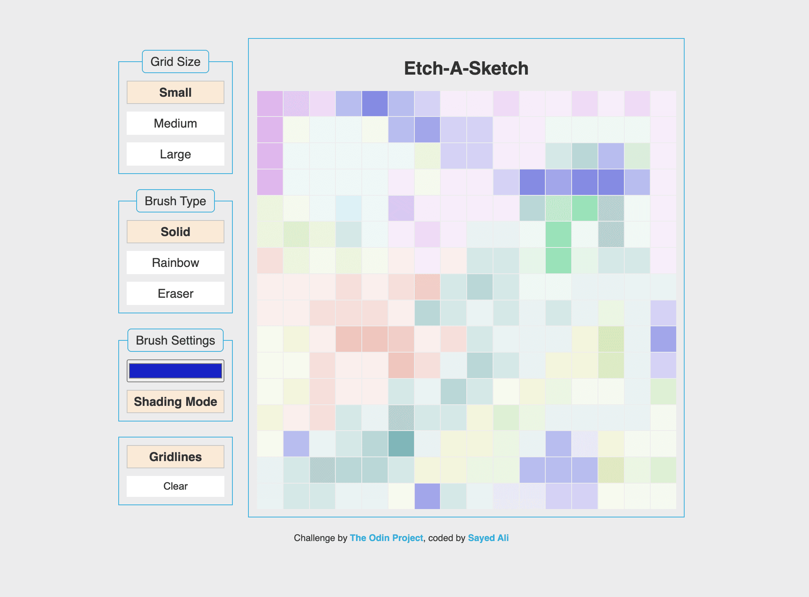

# The Odin Project - Project Sketch a Sketch

This is a solution to the [Sketch-a-Sketch project from The Odin Project](https://www.theodinproject.com/lessons/foundations-etch-a-sketch).

- Solution on [GitHub](https://your-solution-url.com)
- Live Site on [Netlify](https://your-live-site-url.com)

## Features

- Select grid size from 3 options
- Select brush type from 3 options.
  - A single click causes a single square to get filled
  - A single click and drag starts drawing
  - A double click activates sticky mode.
- Select brush color.
- Change brush mode to _Shading Mode_.
  - In this mode, the _solid_ brush would progressively darken a square to its full value in 10 iterations.
  - Similarly, the _eraser_ brush would lighten a square to full white in 10 iterations.
  - This mode does not affect the _rainbow_ brush.
- Toggle gridlines.
- Clear the grid.

## What I learned

- `offsetWidth` to get an element's width
- When setting an elements style width using JS, you need to specify the unit as well!
- Using `element.style.backgroundColor = ""` will completely remove that style.
- When accessing style properties directly (for example, `e.target.style.opacity`), there are returned as strings; so when trying to do math on them they should first be converted to numbers. .
